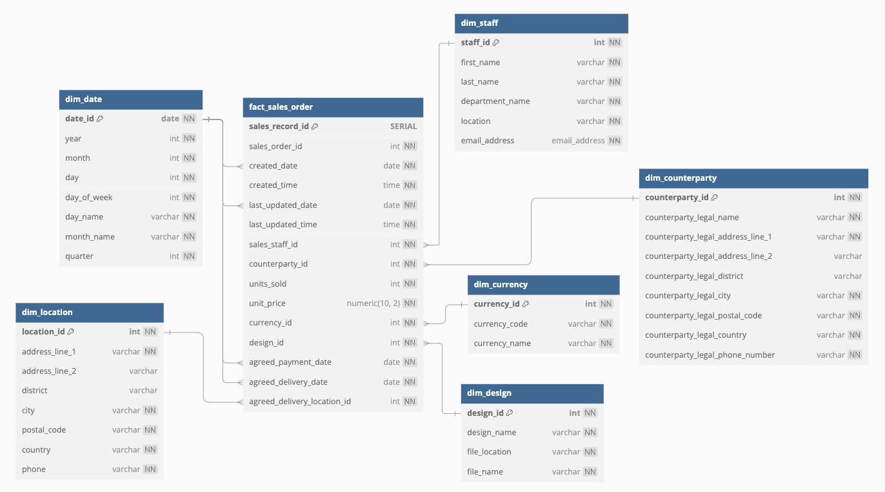
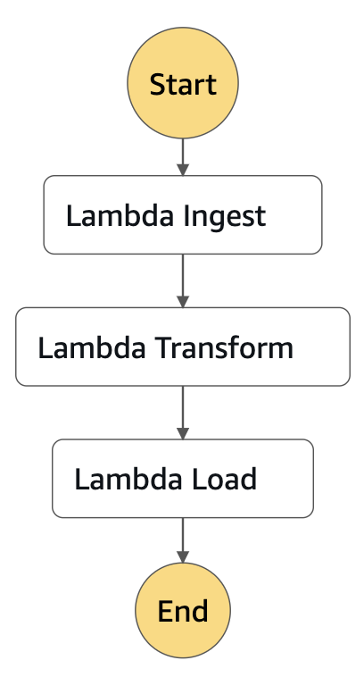
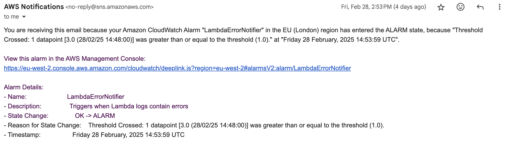
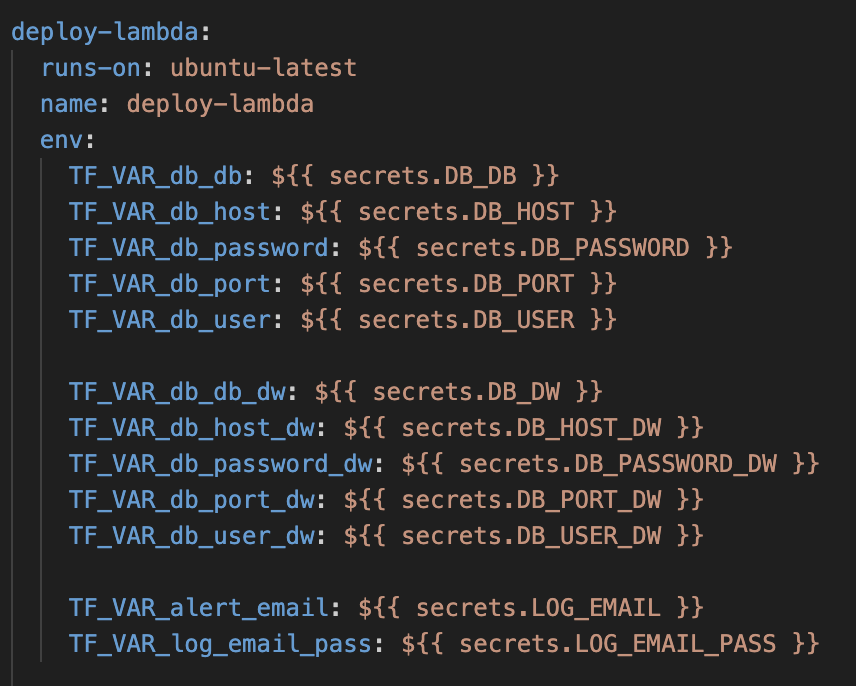

# <center>**DATA ENGINEERING FINAL PROJECT**</center>

## Project Overview:

The following directory acts as an Extract-Transform-Load (ETL) pipeline, transporting and re-structuring raw, unformatted data to Dimension and Fact tables, specifically in accordance with several predetermined, outlined Star Schemas. This is achieved primarily through the use of *Cloud Engineering*, *Data Engineering* and *Code as Infrastructure* principals and thus fundamentally relies on the commissioning of Amazon-Web-Services (AWS) resources utilising Terraform along-side fully tested and reviewed Python scripts. In addition, throughout the project, *Continuous Integration and Continuous Delivery* (CI/CD) was practiced, alongside *Test-Driven Development* (TTD) to maximise both the effectiveness and validity of such code, as written and deployed.
<center>

</center>


Principally, the structure of this infrastructure is represented within the above diagram. A scheduler was intialised to trigger an AWS State-Machine every 20 minutes, which in-turn activates all three lambda sequentially encapsulated within the aforementioned State-Machine. Details on the following three Lambdas is as follows. 


## Set-Up Guidance:
### Prerequisites

- Installed Python 3.7+ (recommended)
- Installed pip package manager
- Store database credentials for both initial PSQL datasource (DB) and resulting Data Warehouse (DB_DW) within Github Action's Secret Manager.
-  Store your AWS account credentials, specifically Access Key and Secret Access Key, within Github Action's Secret Manager (For more information on this, see the *'Hidden Varibles'* section below).
-  In your AWS console, manually create an s3 Data Bucket dedicated to holding your *'terraform.tfstate'* file (For more information, see the *'State Bucket'* section below.)
-  Ensure that any modifications within the src code for the Lambdas are accurately reflected within the Dependencies section (For more information, see the *'Lambda Dependencies'* section).

### Install Dependencies
1) Clone the repository:

```bash
git clone https://github.com/yourusername/yourproject.git
cd yourproject
```
2) Create and activate a virtual environment (optional but recommended):

```bash
python -m venv venv
source venv/bin/activate  # On Windows, use venv\Scripts\activate
```

3) Install the required packages:

```bash
pip install -r requirements.txt
```

## Lambda One (Extraction):

The initial Lambda, a serverless computing service delivered by AWS, extracts raw, unformatted data from the *TOTESYS* PSQL database using pg8000, and dumps it into a specified s3 Ingestion Bucket (a cloud storage system delivered by AWS) as a .csv file, structured by tablename, year, month and day:

<center>

```python
f"{table_name}/{year}/{month}/{day}/{time_stamp}.csv"
```
</center>

The lambda utilises timestamp-based referencing to ascertain which data entries within the *TOTESYS* PSQL database are new, and which have already been extracted into the s3 Ingestion Bucket and thus unwanted data-duplication is prohibited.

## Lambda Two (Transformation):

The second Lamba transforms all extracted data from the s3 Ingestion Bucket, specifically in accordance with the following Star Schemas, as outlined below:

<center>

</center>

This is accomplished, primarily, through leveraging the Pandas module and manipulating / re-structuring the raw, unformatted data into an informed and readable format. Such data is then outputted within *parquet* format to a second s3 Bucket, specifically for processed data, otherwise termed 'Transformation Bucket'.  

## Lambda Three (Load):

The third and final Lambda is responsible for loading the transformed data from the s3 Transformation Bucket into a Redshift Data Warehouse, hosted by AWS. Tables have to created before inserting data.


## State-Machine and Scheduling:
All lambdas exist within the scope of AWS's State-Machine, a event-driven workflow allowing seemless integration between all of the cloud infrastructure, as deployed within this repository. The inital lambda is triggered, and thus begins ingesting data from the *TOTESYS* database every 20 minutes. Both subsequent Lambdas (both Transformation and Load) are trigger to execute when new data is dumped into the s3 Bucket that proceeds them within the State-Machine, consequently allowing for the data to be successfully transported down the ETL pipeline: 

<center>

</center>

## Extra Features:

#### Cloudwatch Logging:
- Multi-tier logging is implemented throughout the lambda scripts and varying other infrastructure-related resources, as deployed via Terraform. Collected via AWS's Cloudwatch, such messages log error- and success- related information specifically detailing the condition of the entire ETL pipeline, start to finish.

#### Email Alerts:
- In the event that the Cloudwatch Logging System encounters an error, an informative message is delivered to a shared email address- "NotificationStreamBanshee@Gmail.com"- allowing for quick resolution by the DevOps team:

<center>

</center>

- To use a different email address, specify it in the hidden variables and confirm the subscription by clicking on SubscribeURL when Amazon SNS sends a confirmation message to your endpoint.

#### Lambda Dependencies:
- All of the Lambda dependencies exist within a designated Dependencies/Python file, within which additional Python packages and modules not innately supported by AWS's serverless computing are deployed. For this reason, any changes to the requirements.txt file within this repository must be reflected in the dependencies section to ensure no ModuleNotFound errors are incorrectly raised. 

#### State Bucket:
- The Terraform state file, utilised by Terraform to map real-world resources to your configuration, keep track of metadata, and improve performance for large infrastructures, is stored in a seperate s3 Bucket, deployed via the AWS console. This allows for cross-platform collaboration between the our team and prevents issues with non-centralised modifications to the Terraform state. 

## CI/CD and Testing
GitHub Actions: The build, test and deploy pipeline central to the development of this repositiory was automated through Github Actions in accordance to our *"test-and-deploy.yml"* file. This ensured that all scripts pushed to this repository underwent stringent validation prior to being incorporated and deployed. 
Testing: all Python scripts were fully PEP8 compliant through leveraging Flake8, Black, Bandit and passed respective unittests and furthermore meant that all Terraform-deployed AWS resources were valid and well-formed. 

## Hidden Variables

All variables representing sensitive data (mainly pertaining to access credentials for the Data Warehouse and SYSTOTE PSQL Database) are strategically hidden within GitHub Action's Secret Manager, preventing accidental exposure and prioritising cybersecurity. Such variables were manually inputted into Github Action's Secret Manager, and were subsequently collected for the environment at hand through our .YAML file:
<center>

</center>

## Comprehensive List of Used Technologies:

<details>
<summary><strong>Amazon Web Services (AWS):</strong></summary>

    - S3 Data Buckets  
    - State Machine
    - Scheduler (Rule)
    - CloudWatch
    - Lambda
</details>


<details>
<summary><strong>Python External Modules:</strong></summary>

    - Pyarrow.
    - Pg8000.
    - Boto3.
    - Moto.
    - Pandas. 
    - Bandit.
    - Black. 
    - Numpy.
    - Pytest.
    - SQLAlchemy.
</details>

## Repository Authors:
- Shea Macfarlane.
- Mihai Misai. 
- Meral Hewitt. 
- Anna Fedyna.
- Carlo Danieli. 
- Ahmad Fadhli.


